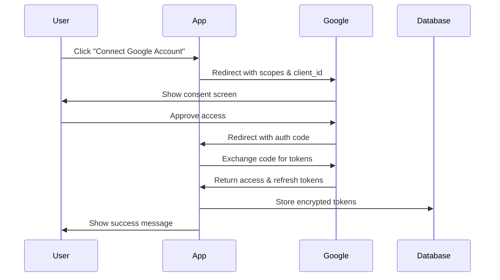

## Overview

Reportr uses Google OAuth 2.0 for two purposes:
1. **User Authentication** - Sign in with Google via NextAuth.js
2. **API Access** - Connect client Google accounts to fetch Search Console and Analytics data

Both use the same OAuth client but with different scopes.

## Setup Google OAuth Client

### 1. Create OAuth Credentials

1. Go to [Google Cloud Console](https://console.cloud.google.com/)
2. Create or select a project
3. Navigate to **APIs & Services** → **Credentials**
4. Click **Create Credentials** → **OAuth 2.0 Client ID**
5. Select **Web application**
6. Configure authorized redirect URIs:

```
http://localhost:3000/api/auth/callback/google
https://yourdomain.com/api/auth/callback/google
```

### 2. Enable Required APIs

Enable these APIs in Google Cloud Console:

- **Google+ API** (for user profile)
- **Google Search Console API** (for SEO data)
- **Google Analytics API** (for analytics data)
- **PageSpeed Insights API** (for performance metrics)

### 3. Configure Environment Variables

Add to your `.env` file:

<ParamField path="GOOGLE_CLIENT_ID" type="string" required>
  OAuth 2.0 Client ID from Google Cloud Console
</ParamField>

<ParamField path="GOOGLE_CLIENT_SECRET" type="string" required>
  OAuth 2.0 Client Secret from Google Cloud Console
</ParamField>

<ParamField path="GOOGLE_REDIRECT_URI" type="string" required>
  OAuth callback URL. Must match authorized redirect URIs in Google Console.
  
  Example: `http://localhost:3000/api/auth/callback/google`
</ParamField>

<ParamField path="PAGESPEED_API_KEY" type="string" required>
  Google API key for PageSpeed Insights API
</ParamField>

## Authentication Flow

### User Sign-In (NextAuth.js)

Configured in `src/lib/auth.ts:26`:

```typescript
import GoogleProvider from 'next-auth/providers/google';

providers: [
  GoogleProvider({
    clientId: process.env.GOOGLE_CLIENT_ID!,
    clientSecret: process.env.GOOGLE_CLIENT_SECRET!,
  })
]
```

**Default Scopes:**
- `openid` - OpenID Connect
- `email` - User email address
- `profile` - Basic profile info (name, picture)

**Flow:**
1. User clicks "Sign in with Google"
2. Redirected to Google consent screen
3. User approves access
4. Google redirects to `/api/auth/callback/google`
5. NextAuth.js creates/updates user record
6. Session created with JWT token

### Client API Access

For accessing client Google data (Search Console, Analytics), a separate OAuth flow with extended scopes is required.

#### Authorization Route

From `src/app/api/auth/google/authorize/route.ts:7`:

```typescript
import { google } from 'googleapis';
import { NextRequest, NextResponse } from 'next/server';

export async function GET(request: NextRequest) {
  const { searchParams } = request.nextUrl;
  const clientId = searchParams.get('clientId');
  
  if (!clientId) {
    return NextResponse.json({ error: 'Client ID required' }, { status: 400 });
  }
  
  const baseUrl = process.env.NEXTAUTH_URL || request.nextUrl.origin;
  const redirectUri = `${baseUrl}/api/auth/google/callback`;
  
  const oauth2Client = new google.auth.OAuth2(
    process.env.GOOGLE_CLIENT_ID,
    process.env.GOOGLE_CLIENT_SECRET,
    redirectUri
  );
  
  const scopes = [
    'https://www.googleapis.com/auth/webmasters.readonly',
    'https://www.googleapis.com/auth/analytics.readonly',
    'openid',
    'email',
    'profile'
  ];
  
  const authUrl = oauth2Client.generateAuthUrl({
    access_type: 'offline',
    scope: scopes,
    state: clientId,
    prompt: 'consent',
    redirect_uri: redirectUri
  });
  
  return NextResponse.redirect(authUrl);
}
```

**Extended Scopes:**

<ParamField path="webmasters.readonly" type="scope" required>
  Read-only access to Google Search Console data
</ParamField>

<ParamField path="analytics.readonly" type="scope" required>
  Read-only access to Google Analytics data
</ParamField>

**Parameters:**

<ParamField path="access_type" type="string" default="offline">
  Request refresh token for long-term access without user re-authentication
</ParamField>

<ParamField path="prompt" type="string" default="consent">
  Force consent screen to ensure refresh token is returned
</ParamField>

<ParamField path="state" type="string" required>
  Client ID to associate tokens with the correct client record
</ParamField>

## OAuth Flow Diagram



## Token Management

### Storing Tokens Securely

<Warning>
  Always encrypt OAuth tokens before storing in database. Never log tokens.
</Warning>

```typescript
import { encrypt } from '@/lib/encryption'

// After OAuth callback
const encryptedAccessToken = await encrypt(tokens.access_token)
const encryptedRefreshToken = await encrypt(tokens.refresh_token)

await prisma.client.update({
  where: { id: clientId },
  data: {
    googleAccessToken: encryptedAccessToken,
    googleRefreshToken: encryptedRefreshToken,
    tokenExpiresAt: new Date(Date.now() + tokens.expires_in * 1000),
    isGoogleConnected: true
  }
})
```

### Refreshing Access Tokens

Access tokens expire after 1 hour. Use refresh tokens to get new access tokens:

```typescript
import { google } from 'googleapis'
import { decrypt } from '@/lib/encryption'

async function refreshAccessToken(client: Client) {
  const oauth2Client = new google.auth.OAuth2(
    process.env.GOOGLE_CLIENT_ID,
    process.env.GOOGLE_CLIENT_SECRET
  )
  
  // Decrypt stored refresh token
  const refreshToken = await decrypt(client.googleRefreshToken!)
  oauth2Client.setCredentials({ refresh_token: refreshToken })
  
  // Request new access token
  const { credentials } = await oauth2Client.refreshAccessToken()
  
  // Encrypt and store new access token
  const encryptedAccessToken = await encrypt(credentials.access_token!)
  
  await prisma.client.update({
    where: { id: client.id },
    data: {
      googleAccessToken: encryptedAccessToken,
      tokenExpiresAt: new Date(Date.now() + credentials.expiry_date!)
    }
  })
  
  return credentials.access_token
}
```

### Automatic Token Refresh

```typescript
async function getValidAccessToken(client: Client) {
  // Check if token is expired or expires soon (within 5 minutes)
  const expiresAt = client.tokenExpiresAt
  const now = new Date()
  const fiveMinutesFromNow = new Date(now.getTime() + 5 * 60 * 1000)
  
  if (!expiresAt || expiresAt < fiveMinutesFromNow) {
    console.log('Token expired or expiring soon, refreshing...')
    return await refreshAccessToken(client)
  }
  
  // Token still valid, decrypt and return
  return await decrypt(client.googleAccessToken!)
}
```

## Making API Requests

### Using googleapis Client

```typescript
import { google } from 'googleapis'

async function fetchSearchConsoleData(client: Client) {
  // Get valid access token (auto-refreshes if needed)
  const accessToken = await getValidAccessToken(client)
  
  // Create OAuth2 client
  const oauth2Client = new google.auth.OAuth2()
  oauth2Client.setCredentials({ access_token: accessToken })
  
  // Initialize Search Console API
  const searchconsole = google.searchconsole({ version: 'v1', auth: oauth2Client })
  
  // Make API request
  const response = await searchconsole.searchanalytics.query({
    siteUrl: client.siteUrl,
    requestBody: {
      startDate: '2024-01-01',
      endDate: '2024-01-31',
      dimensions: ['query', 'page'],
      rowLimit: 1000
    }
  })
  
  return response.data
}
```

### Analytics API Example

```typescript
import { google } from 'googleapis'

async function fetchAnalyticsData(client: Client) {
  const accessToken = await getValidAccessToken(client)
  
  const oauth2Client = new google.auth.OAuth2()
  oauth2Client.setCredentials({ access_token: accessToken })
  
  const analytics = google.analyticsdata({ version: 'v1beta', auth: oauth2Client })
  
  const response = await analytics.properties.runReport({
    property: `properties/${client.ga4PropertyId}`,
    requestBody: {
      dateRanges: [{ startDate: '30daysAgo', endDate: 'today' }],
      metrics: [
        { name: 'activeUsers' },
        { name: 'sessions' },
        { name: 'bounceRate' },
        { name: 'averageSessionDuration' }
      ],
      dimensions: [{ name: 'date' }]
    }
  })
  
  return response.data
}
```

## Error Handling

### Common OAuth Errors

<ResponseField name="invalid_grant" type="error">
  Refresh token is invalid or expired. User needs to re-authorize.
  
  **Solution:** Redirect user to authorization flow again.
</ResponseField>

<ResponseField name="insufficient_permissions" type="error">
  Token doesn't have required scopes.
  
  **Solution:** Check scope configuration in authorization URL.
</ResponseField>

<ResponseField name="invalid_client" type="error">
  OAuth client credentials are incorrect.
  
  **Solution:** Verify `GOOGLE_CLIENT_ID` and `GOOGLE_CLIENT_SECRET` in `.env`.
</ResponseField>

<ResponseField name="redirect_uri_mismatch" type="error">
  Redirect URI doesn't match Google Console configuration.
  
  **Solution:** Ensure redirect URI matches exactly in Google Cloud Console.
</ResponseField>

### Error Handling Example

```typescript
try {
  const data = await fetchSearchConsoleData(client)
  return data
} catch (error: any) {
  if (error.code === 401 || error.message?.includes('invalid_grant')) {
    // Token invalid, mark client as disconnected
    await prisma.client.update({
      where: { id: client.id },
      data: { 
        isGoogleConnected: false,
        googleAccessToken: null,
        googleRefreshToken: null
      }
    })
    
    throw new Error('Google authorization expired. Please reconnect your account.')
  }
  
  if (error.code === 403) {
    throw new Error('Insufficient permissions. Please ensure you have access to this Google property.')
  }
  
  // Log and rethrow other errors
  console.error('Google API error:', error)
  throw error
}
```

## Testing OAuth Flow

### Local Development

1. Add `http://localhost:3000/api/auth/callback/google` to authorized redirect URIs
2. Set `NEXTAUTH_URL=http://localhost:3000` in `.env`
3. Start dev server: `npm run dev`
4. Test sign-in at `http://localhost:3000/api/auth/signin`

### Production Checklist

<Check>
  Production domain added to authorized redirect URIs
</Check>

<Check>
  `NEXTAUTH_URL` set to production domain
</Check>

<Check>
  OAuth consent screen configured and verified
</Check>

<Check>
  Required APIs enabled in Google Cloud Console
</Check>

<Check>
  Token encryption keys set in environment
</Check>

## Rate Limits & Quotas

### Google API Quotas

<ParamField path="Search Console API" type="quota">
  - **Queries per day:** 1,200
  - **Queries per 100 seconds:** 600
  - **Queries per user per 100 seconds:** 300
</ParamField>

<ParamField path="Analytics API" type="quota">
  - **Requests per day:** 50,000
  - **Requests per 100 seconds per project:** 2,000
  - **Requests per 100 seconds per user:** 10
</ParamField>

### Quota Management

```typescript
import { RateLimiter } from '@/lib/rate-limiter'

const searchConsoleRateLimiter = new RateLimiter({
  maxRequests: 300,
  windowMs: 100 * 1000 // 100 seconds
})

async function fetchWithRateLimit(client: Client) {
  await searchConsoleRateLimiter.checkLimit(client.userId)
  
  try {
    return await fetchSearchConsoleData(client)
  } catch (error: any) {
    if (error.code === 429) {
      // Rate limited, wait and retry
      await new Promise(resolve => setTimeout(resolve, 60000))
      return await fetchSearchConsoleData(client)
    }
    throw error
  }
}
```

## Security Best Practices

<Warning>
  Critical security considerations for OAuth implementation
</Warning>

1. **Never expose tokens in client-side code**
   ```typescript
   // ❌ BAD
   const token = client.googleAccessToken
   
   // ✅ GOOD
   const token = await decrypt(client.googleAccessToken!)
   ```

2. **Always use HTTPS in production**
   - Google OAuth requires HTTPS for redirect URIs (except localhost)

3. **Validate state parameter**
   - Prevents CSRF attacks in OAuth flow

4. **Store tokens encrypted**
   - Use AES-256 encryption for tokens at rest

5. **Implement token rotation**
   - Regularly refresh and rotate access tokens

6. **Monitor for suspicious activity**
   - Log all OAuth authorization attempts
   - Alert on unusual access patterns

## Troubleshooting

### "redirect_uri_mismatch" Error

**Cause:** Redirect URI doesn't match Google Console configuration.

**Solution:**
```bash
# Check your redirect URI
echo $GOOGLE_REDIRECT_URI

# Ensure it matches EXACTLY in Google Cloud Console
# Common issues:
# - http vs https
# - trailing slash
# - port number mismatch
```

### "invalid_client" Error

**Cause:** Client ID or secret is incorrect.

**Solution:**
```bash
# Verify credentials are set
echo $GOOGLE_CLIENT_ID
echo $GOOGLE_CLIENT_SECRET

# Re-download credentials from Google Console if needed
```

### Tokens Not Refreshing

**Cause:** No refresh token received.

**Solution:**
- Ensure `access_type: 'offline'` in authorization URL
- Use `prompt: 'consent'` to force consent screen
- Refresh tokens only returned on first authorization

### "insufficient_permissions" Error

**Cause:** Missing required scopes.

**Solution:**
- Check scopes array in authorization route
- User may need to re-authorize with new scopes
- Verify APIs are enabled in Google Console

## Related Pages

- [NextAuth.js Configuration](/api/authentication/nextauth)
- [Search Console API](/api/google/search-console)
- [Analytics API](/api/google/analytics)