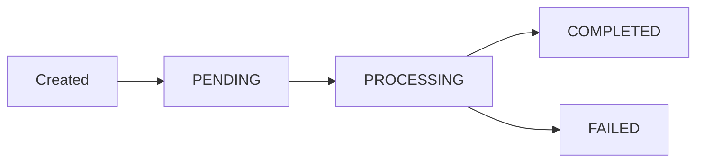

## Overview

Reports in Reportr go through multiple processing states from creation to completion. The status field provides real-time visibility into the report generation pipeline, allowing you to track progress, handle errors, and provide user feedback.

## Report Status Enum

The `ReportStatus` enum is defined in the Prisma schema and has four possible values:

```prisma
enum ReportStatus {
  PENDING
  PROCESSING
  COMPLETED
  FAILED
}
```

## Status Definitions

### PENDING

**Description:** Report has been created and queued for processing but generation has not started.

**Characteristics:**
- `processingStartedAt` is `null`
- `processingCompletedAt` is `null`
- `pdfUrl` is `null`
- `data` field contains the input configuration

**Typical Duration:** 0-5 seconds (immediate processing in current implementation)

**Next State:** `PROCESSING`

**Use Case:** This status exists for future queue-based processing implementation. Currently, reports move immediately to PROCESSING.

---

### PROCESSING

**Description:** Report generation is actively in progress. The system is fetching data, generating AI insights, and creating the PDF.

**Characteristics:**
- `processingStartedAt` has a timestamp
- `processingCompletedAt` is `null`
- `pdfUrl` is `null`
- AI insights are being generated
- PDF is being rendered with React-PDF

**Typical Duration:** 15-45 seconds

**Processing Steps:**
1. User authentication and authorization (1s)
2. Plan limit verification (1s)
3. Client ownership validation (1s)
4. AI insights generation with Claude API (3-8s)
5. PDF rendering with React-PDF (5-15s)
6. Upload to Vercel Blob storage (1-3s)
7. Database record update (1s)

**Next State:** `COMPLETED` (success) or `FAILED` (error)

**Timeout:** 60 seconds (serverless function maximum duration)

---

### COMPLETED

**Description:** Report generation finished successfully. The PDF is available for download.

**Characteristics:**
- `processingStartedAt` has a timestamp
- `processingCompletedAt` has a timestamp
- `pdfUrl` contains the Vercel Blob storage URL
- `pdfSize` contains file size in bytes
- `generationTimeMs` contains total processing time
- `errorMessage` is `null`
- AI insights may be present (depending on AI service availability)

**Data Available:**
- Complete analytics data in `data` field
- AI-generated insights in `aiInsights` array
- PDF download URL in `pdfUrl`
- Performance metrics (`generationTimeMs`, `aiTokensUsed`, `aiCostUsd`)

**Permanence:** This is a terminal state. Reports remain COMPLETED indefinitely unless manually deleted.

---

### FAILED

**Description:** Report generation encountered an unrecoverable error and could not complete.

**Characteristics:**
- `processingStartedAt` may have a timestamp (if processing began)
- `processingCompletedAt` is `null`
- `pdfUrl` is `null`
- `errorMessage` contains error details
- `generationTimeMs` may be present (time until failure)

**Common Failure Reasons:**
- **Validation errors:** Invalid input data structure
- **Authentication errors:** Session expired during processing
- **API failures:** Google API or Claude API unavailable
- **PDF rendering errors:** React-PDF timeout or memory issues
- **Storage errors:** Vercel Blob upload failed
- **Database errors:** Prisma connection or query failures
- **Timeout:** Processing exceeded 60 second limit

**Error Message Examples:**
```
"React-PDF generation failed: renderToBuffer timeout after 30000ms"
"PDF storage failed: Unable to save PDF to cloud storage"
"PDF generation service temporarily unavailable"
"Validation failed: Expected number, received string at gscData.clicks"
```

**Recovery:** FAILED status is terminal. Users must regenerate the report with corrected parameters.

---

## Status Transitions



**Valid Transitions:**
- `null` → `PENDING` (report created)
- `PENDING` → `PROCESSING` (generation started)
- `PROCESSING` → `COMPLETED` (success)
- `PROCESSING` → `FAILED` (error)

**Invalid Transitions:**
- Cannot go from `COMPLETED` or `FAILED` to any other state
- Cannot skip states (e.g., `PENDING` → `COMPLETED`)

## Checking Report Status

Use the [Retrieve Report](/api/reports/retrieve) endpoint to check the current status:

```bash
curl -X GET https://your-domain.com/api/reports/{reportId} \
  -H "Cookie: next-auth.session-token=..."
```

The response includes the `status` field:

```json
{
  "id": "clxreport123",
  "status": "PROCESSING",
  "processingStartedAt": "2024-02-01T10:25:15.123Z",
  "processingCompletedAt": null,
  "pdfUrl": null,
  "errorMessage": null
}
```

## Polling for Completion

For asynchronous report generation (future implementation), implement polling:

```javascript
async function waitForReportCompletion(reportId) {
  const maxAttempts = 60 // 60 attempts
  const pollInterval = 2000 // 2 seconds
  
  for (let i = 0; i < maxAttempts; i++) {
    const response = await fetch(`/api/reports/${reportId}`)
    const report = await response.json()
    
    if (report.status === 'COMPLETED') {
      return { success: true, pdfUrl: report.pdfUrl }
    }
    
    if (report.status === 'FAILED') {
      return { success: false, error: report.errorMessage }
    }
    
    // Still processing, wait and retry
    await new Promise(resolve => setTimeout(resolve, pollInterval))
  }
  
  return { success: false, error: 'Timeout waiting for report' }
}
```

## Status in List Reports

The [List Reports](/api/reports/list) endpoint includes status for filtering:

```javascript
// Get all completed reports
const completedReports = reports.filter(r => r.status === 'COMPLETED')

// Get failed reports for troubleshooting
const failedReports = reports.filter(r => r.status === 'FAILED')

// Get reports still being processed
const processingReports = reports.filter(r => r.status === 'PROCESSING')
```

## Database Schema

The status field is defined in the Report model:

```prisma
model Report {
  id                    String       @id @default(cuid())
  status                ReportStatus @default(PENDING)
  processingStartedAt   DateTime?
  processingCompletedAt DateTime?
  errorMessage          String?
  generationTimeMs      Int?
  
  // ... other fields
  
  @@index([status])
}
```

The `@@index([status])` directive creates a database index for efficient status-based queries.

## Monitoring and Analytics

### Success Rate

Calculate report generation success rate:

```sql
SELECT 
  COUNT(*) FILTER (WHERE status = 'COMPLETED') as completed,
  COUNT(*) FILTER (WHERE status = 'FAILED') as failed,
  COUNT(*) as total,
  ROUND(100.0 * COUNT(*) FILTER (WHERE status = 'COMPLETED') / COUNT(*), 2) as success_rate
FROM reports
WHERE "createdAt" > NOW() - INTERVAL '30 days';
```

### Average Generation Time

Track performance by status:

```sql
SELECT 
  status,
  COUNT(*) as count,
  AVG("generationTimeMs") as avg_time_ms,
  MIN("generationTimeMs") as min_time_ms,
  MAX("generationTimeMs") as max_time_ms
FROM reports
WHERE status = 'COMPLETED'
GROUP BY status;
```

### Error Analysis

Identify common failure patterns:

```sql
SELECT 
  "errorMessage",
  COUNT(*) as occurrence_count
FROM reports
WHERE status = 'FAILED'
GROUP BY "errorMessage"
ORDER BY occurrence_count DESC
LIMIT 10;
```

## Best Practices

### For Frontend Developers

1. **Show status to users:** Display clear status indicators (loading spinner for PROCESSING, success checkmark for COMPLETED, error icon for FAILED)

2. **Handle all states:** Account for all four status values in your UI logic

3. **Display error messages:** Show `errorMessage` to users when status is FAILED

4. **Implement retry:** Allow users to regenerate failed reports with corrected parameters

5. **Cache completed reports:** Don't re-fetch completed reports unnecessarily

### For Backend Developers

1. **Set status immediately:** Update status to PROCESSING as soon as generation starts

2. **Always set final status:** Ensure PROCESSING reports transition to COMPLETED or FAILED

3. **Detailed error messages:** Provide actionable error messages for debugging

4. **Log status transitions:** Log all status changes for monitoring and debugging

5. **Handle timeouts gracefully:** Set status to FAILED if processing exceeds time limits

### For API Consumers

1. **Check status before downloading:** Verify status is COMPLETED before accessing pdfUrl

2. **Handle asynchronous generation:** Implement polling or webhooks for async workflows

3. **Parse error messages:** Extract useful information from errorMessage for user display

4. **Track generation metrics:** Monitor generationTimeMs for performance optimization

## Future Enhancements

### Planned Status Features

- **Webhooks:** Notify external systems when status changes to COMPLETED or FAILED
- **Progress percentage:** Add sub-states to PROCESSING (e.g., "Fetching data", "Generating insights", "Creating PDF")
- **Retry mechanism:** Automatic retry for transient failures (API timeouts, rate limits)
- **Queue position:** Show position in queue for PENDING reports
- **Estimated completion:** Predict completion time based on historical data

## Related Endpoints

- [Generate Report](/api/reports/generate) - Create a new report (sets initial status)
- [List Reports](/api/reports/list) - Get all reports with status filtering
- [Retrieve Report](/api/reports/retrieve) - Get detailed status information
